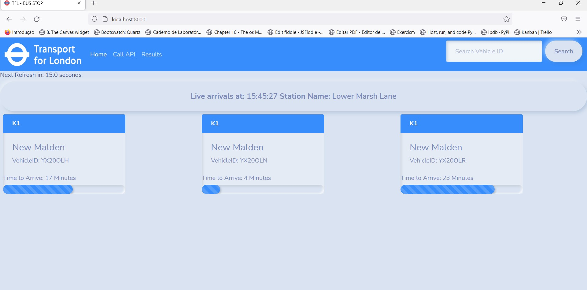
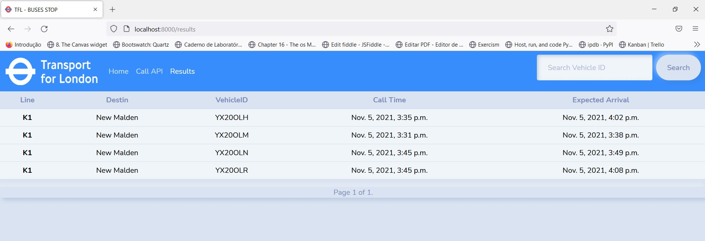

TFL - London: A simple webapp to capture arrivals from tlf.gov.uk(API)
=========================================================== 
The solution developed here is very simple and fast, unfortunately I didn't have time to refactor and fix possible bugs, but it's work well.

Install and run
=============
The instructions provided below are only to run the application in development mode using Django development web server.
a) Clone this repo and install the requirements as follows::

    $ pip install -r requirements.txt

b) Run the django server as follows:
 
    $  python manage.py runserver

c) Point your browser to the end point http://localhost:8000/ to fetch arrival data about "490009333W".

d) Point your browser to the end point http://localhost:8000/results to see historical data

e) Point your browser to the end point http://localhost:8000/api to see tfl api

        
 Some representative screenshots
===============================

The database model
====================

    class Buses(models.Model):
        line_name = models.CharField(max_length=5)
        destination_name = models.CharField(max_length=15)
        vehicle_id = models.CharField(max_length=10, unique=True)
        expected_arrival = models.DateTimeField('expected')
        time_now = models.DateTimeField('time Now')

    def __str__(self):
        return self.vehicle_id
